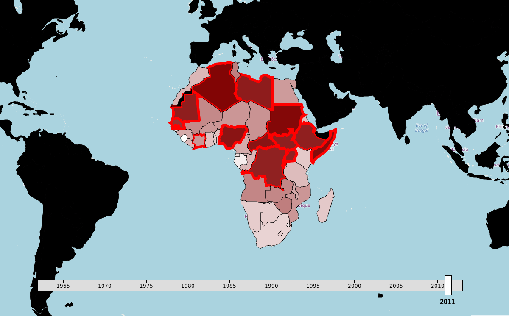

# African Armed Conflicts: Visualization & Forecasting

Predicting Interstate and Internal Conflicts using Small & Medium Arms Imports, Military Expenditures, Fraction of Population in the Army, etc. We use a time-series framework to tackle the problem.

[Link to interactive map](http://jeanromainroy.com/dataviz_armed_conflict.html)

# Model

Bagged Random Forest (0.9) and Neural Network (0.1)

# Overview

Let's first look at all the files in the repo

	$ tree --dirsfirst --filelimit 100

	.
	├── analysis
	│   ├── data
	│   │   ├── nisat
	│   │   │   ├── resources
	│   │   │   │   ├── NISAT database public user manual.pdf
	│   │   │   │   └── nisat_query.png
	│   │   │   ├── arms_trades_exports.csv
	│   │   │   ├── arms_trades_imports.csv
	│   │   │   ├── arms_trades.zip
	│   │   │   ├── preproc_arms_import.csv
	│   │   │   └── prio_weapons_code.txt
	│   │   ├── output
	│   │   │   ├── african_countries.json
	│   │   │   ├── arms_imports.json
	│   │   │   ├── conflicts.json
	│   │   │   ├── mil_exp.json
	│   │   │   ├── mil_pers.json
	│   │   │   ├── population.json
	│   │   │   └── predictions.json
	│   │   ├── owid
	│   │   │   ├── military-expenditure-as-a-share-of-gdp.csv
	│   │   │   └── military-personnel-relative-to-total-population.csv
	│   │   ├── population
	│   │   │   └── world_population.csv
	│   │   ├── ucdp
	│   │   │   ├── resources
	│   │   │   │   └── ucdp-dyadic-191.pdf
	│   │   │   └── ucdp-dyadic-191.csv
	│   │   └── world
	│   │       ├── african_countries.csv
	│   │       ├── country_continent.csv
	│   │       └── COW country codes.csv
	│   ├── african_countries_dict.ipynb
	│   ├── nisat-1-scraping.ipynb
	│   ├── owid-1-milexp.ipynb
	│   ├── owid-1-milpers.ipynb
	│   ├── population.ipynb
	│   ├── regression.ipynb
	│   └── ucdp-1-preproc.ipynb
	├── dataviz
	│   ├── assets
	│   │   ├── css
	│   │   │   ├── leaflet.css
	│   │   │   └── style.css
	│   │   ├── img
	│   │   │   └── search.svg
	│   │   └── libs
	│   │       ├── d3.js
	│   │       ├── d3-tip.js
	│   │       ├── leaflet.js
	│   │       └── localization-en.js
	│   ├── data
	│   │   ├── african_countries.json
	│   │   ├── arms_imports.json
	│   │   ├── conflicts.json
	│   │   ├── mil_exp.json
	│   │   ├── mil_pers.json
	│   │   ├── population.json
	│   │   ├── predictions.json
	│   │   └── world.json
	│   ├── scripts
	│   │   ├── 1-preproc.js
	│   │   ├── 2-map.js
	│   │   └── main.js
	│   └── index.html
	├── README.md
	└── screenshot.png

**analysis/** : Contains the notebooks to collect, process, train and predict

**dataviz/** : Contains the interactive map, made with the D3.js library

# Datasets

- [Norwegian Initiative on Small Arms Transfers](http://nisat.prio.org/Trade-Database/Researchers-Database/)
- [Uppsala Conflict Data Program](https://ucdp.uu.se/downloads/)
- [Our World in Data](https://ourworldindata.org/military-spending#data-sources)
- [The World Bank](https://data.worldbank.org/indicator/sp.pop.totl)

# Launching jupyter notebook

Make sure to cd in analysis/ before launching jupyter notebook. If not, the paths won't work

# Authors

* **Jean-Romain Roy** - *Co-author: data collection, preprocessing, logistic regression, random forest, svm, interactive map* - [jeanromainroy](https://github.com/jeanromainroy)
